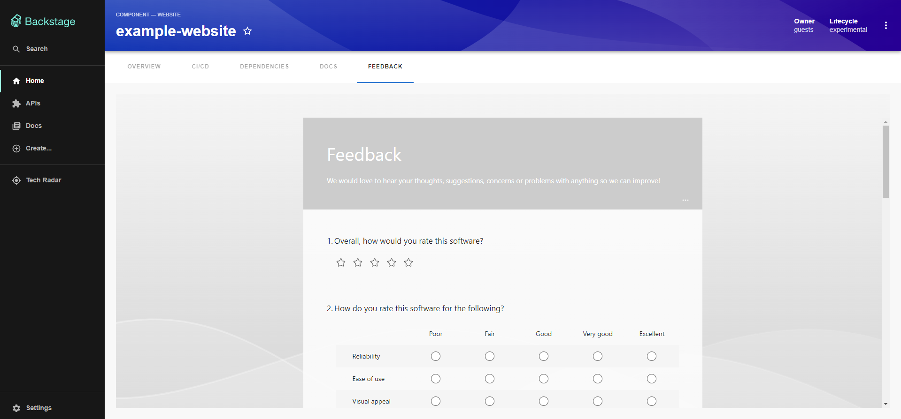

# Microsoft Forms plugin for Backstage

The Microsoft Forms plugin is a frontend plugin that displays Microsoft Forms within Backstage entity page.

## Setup

Find [installation instructions](./docs/setup.md) in our documentation.

## How does it look?

## License

This plugin is under the [MIT](LICENSE) license.