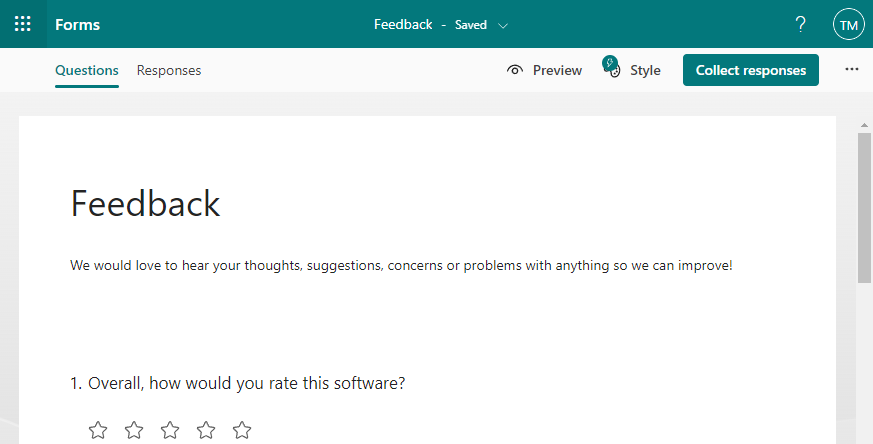
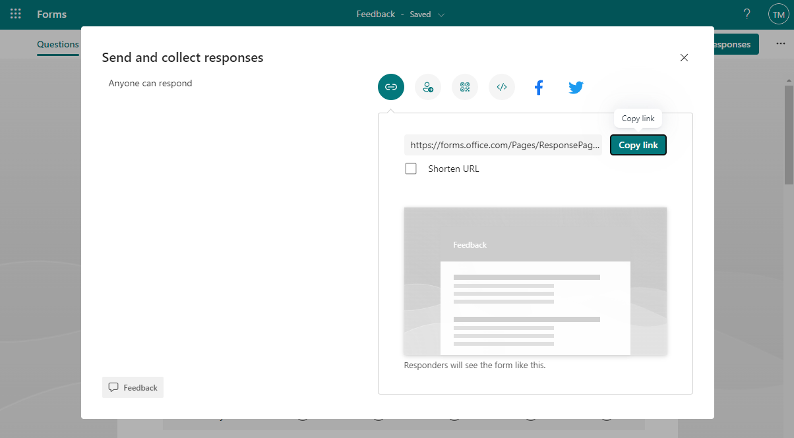

# Installation

Add the plugin to your frontend app:

``` sh
cd packages/app && yarn add @zcmander/backstage-plugin-msforms
```

Add to the entity page:

```ts
import { MSFormContent, hasMSFormsAnnotation } from '@zcmander/backstage-plugin-msforms';

    <EntityLayout.Route
      path="/feedaback"
      title="Feedback"
      if={hasMSFormsAnnotation('feedback')}
    >
      <MSFormContent name="feedback" />
    </EntityLayout.Route>
```

The plugin may to provide multiple tabs per entity depending on configuration in your application. The `hasMSFormsAnnotation` hides the tab if annotation is not present.

In this example `feedback` means suffix in entity annotations, so entity must have `forms.office.com/feedback` annotation to show up in the page.

Then visiting the form that you want to show up in the entity page:



Click **Collect responses** and then **Copy**:



And paste the URL to the `catalog-info.yaml` file where you describe your entity:

```diff
apiVersion: backstage.io/v1alpha1
kind: Component
metadata:
  name: example-website
  annotations:
+    forms.office.com/feedback: https://forms.office.com/Pages/ResponsePage.aspx?id=DQSIkWdsW0yxEjajBLZtrQAAAAAAAAAAAANAARpHfVRUMlZLOU5YMlFVSE1TVU80N1hEUjQ0MFZOQS4u
spec:
  type: website
  lifecycle: experimental
  owner: guests
  system: examples
  providesApis: [example-grpc-api]
```

And you are done!